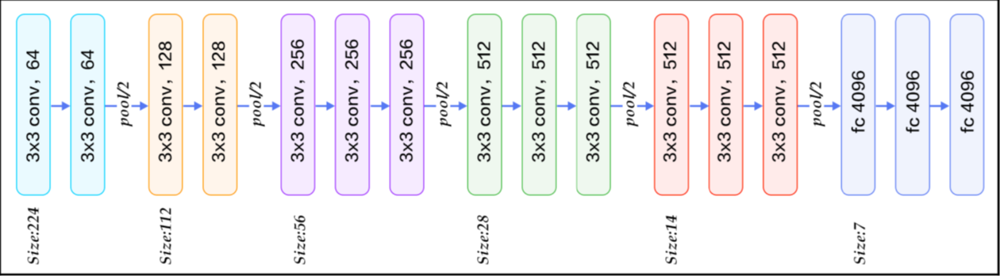

# MSML 612- HWs

## :sparkles: Homework 2: CNNs for Image Classification
HW1 requires you to set up a deep learning tool framework, e.g., Tensorflow, Pytorch, Keras, etc. You need to choose one framework for the rest of this class.

## :scroll:  ToDos:
1. Try to read some articles and get familiar with some of them.

2. Deploy one framework of your choice and run the demo code. You may meet lots of issues before success. Record a short video to show that your demo code runs successfully.
You can find an introductory demo code online and implement it in your framework. E.g., a 2-layer perceptron for MNIST classification

4. In your write-up, describe the advantages and disadvantages of your chosen framework, the preliminary results you get from the demo code, and issues that you encounter in the process.

5. Upload your write-up and video to Canvas.

## :briefcase: Rubrics of Weightage:

1. Write-up quality (clarity, details, etc.) : 30%

2. A working DL framework code : 30%

3. Run a basic demo code using your framework : 40%

## :sparkles: Homework 2: CNNs for Image Classification

We usually use a classic CNN as a feature extractor, since the classic CNN with the parameters pre-trained under ImageNet is available publicly. Given a user provided image, we can extract a feature from some layer in the classic CNN, and then, leverage the feature in different down stream applications.

## :scroll:  In this homework, you need to:

1. Choose a dataset ( [FashionMNIST](https://www.kaggle.com/zalando-research/fashionmnist)  or [CIFAR-10](http://www.cs.toronto.edu/~kriz/cifar.html) ) and choose a classic CNN (VGG, Alex, ResNet…).

2. Choose a feature and extract this feature from each image in the dataset. You need to decide which feature (one or multiple channel in a conv layer, or the neurons in a FC layer, etc.)

3. Visualize the extracted features from all images using TSNE.

4. Quantify the intra-class and inter-class variances of your chosen feature.

5. Report the above in your write-up. Describe what issues you faced and how you resolved them too.

**Note:

Images in FashionMNIST have only one channel, you can repeat the one channel into a 3-channel image.
You may need to resize the input images.

## :briefcase: Rubrics of Weightage:

1. Explain choice of CNN, dataset, and feature : 20%

2. Working CNN code : 15%

3. Visualization of the features : 25%

4. Quantify intra- and inter-class variance : 25% 

5. Quality of write-up (clarity, details, etc.) : 15%

## :sparkles: Homework 3: CNNs for Image Classification

